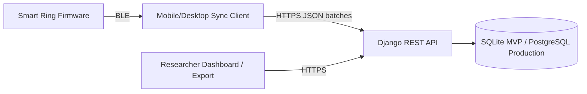
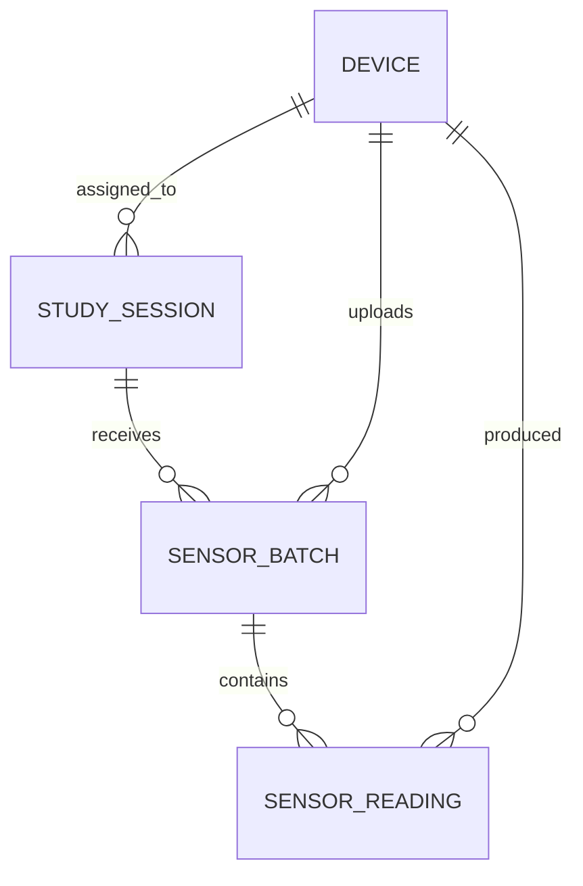

# Open Ring Sync API

This little project is a backend-only Django REST Framework prototype for batched smart-ring sensor data synchronization.

It was built for a technical assessment for Open Ring. It demonstrates how a backend API might register wearable devices, create research study sessions, ingest batches of sensor readings from a simulated sync client, validate incoming data, prevent duplicate ingestion, and expose readings for retrieval or export.

There is no frontend, no real BLE implementation, and no direct communication between the backend and the ring.

## Executive summary

I treated this as an MVP exercise rather than an attempt to build a complete wearable research platform.

The priority was to demonstrate the core backend sync/data-integrity path:

1. register a device
2. create a study session
3. receive a batch of readings from a simulated sync client
4. validate the payload against known devices, sessions, and enabled sensors
5. reject inconsistent or malformed input
6. avoid duplicate ingestion
7. retrieve/export readings for a session

The assumed system boundary is that the smart ring does **not** communicate directly with the backend. Instead, a separate mobile or desktop sync client handles BLE communication, local device reads, retry behaviour, and packaging readings into JSON batches for the API.

This prototype focuses on the backend ingestion workflow only. It intentionally does not implement a frontend dashboard, real BLE communication, authentication, deployment infrastructure, real-time streaming, or large-scale sensor storage.

## Tech stack

- Python
- Django
- Django REST Framework
- SQLite for local development
- drf-spectacular for Swagger documentation

I chose Django and Django REST Framework for three reasons:

- They provide clear data modelling, validation, persistence, API structure, and test support.
- I am personally very familiar with the Django framework.
- Django also provides convenient admin visualisation of the associated database contents during development.

SQLite keeps the assessment lightweight and easy to run locally. In production, I would expect this to move to PostgreSQL or similar, with stronger constraints, indexing, and background processing for heavier ingestion and export workloads.

My IDE was Visual Studio Code.

## Resources used

- Open Ring website, especially the specifications shown at [o-ring.tech](https://o-ring.tech/specifications/)
- Django official documentation
- Code Institute, my most recent Alma Mater, study notes
- AI assistants for code snippets, clarification of scope, README drafting, and test-case brainstorming

## What the project demonstrates

- device registration
- study session creation
- batched sensor-data ingestion
- validation of device, session, and sensor consistency
- duplicate batch handling using `batch_id`
- retrieval/export of readings for a session
- manual API tests for the core success and failure paths using Swagger
- documented assumptions, limitations, and production next steps

## Architecture and data flow

The smart ring does not communicate directly with the backend.

The assumed flow is:

```text
Smart ring firmware
  ↓ BLE
Mobile/Desktop sync client
  ↓ HTTPS JSON batch
Django REST backend (this prototype)
  ↓
Database (SQLite in this prototype, but likely PostgreSQL or similar in production)
  ↓
Researcher dashboard/export
```

For the MVP, I would use a modular monolith backend with a relational database. This keeps study, participant, device, session, and ingestion workflows consistent while the product is still changing. A microservice architecture would be premature for the current scope.



The mobile or desktop sync client is responsible for BLE communication, local device reads, binary decoding, retry behaviour, and packaging readings into JSON batches.

The backend receives normalized JSON batches and treats them as untrusted input. It validates device IDs, session IDs, sensor types, timestamps, duplicate batch IDs, and payload structure before storing readings.

A typical MVP researcher workflow would be:

1. a researcher creates or selects a study
2. a researcher registers one or more smart-ring devices
3. a researcher creates anonymized participant/session records
4. a device is assigned to a participant for a study session
5. the researcher selects which sensor modules are enabled for that session
6. the participant wears the ring during the study period
7. the ring stores sensor readings locally
8. a mobile or desktop sync client reads data from the ring over BLE
9. the sync client uploads JSON batches to the backend
10. the backend validates and stores accepted readings
11. the researcher retrieves or exports session readings for analysis

The platform is not limited to biometric research. It could support biometric, behavioural, interaction, usability, and device-prototyping studies.

## Data model

The implementation uses a lean model:

- `Device`
- `StudySession`
- `SensorBatch`
- `SensorReading`



### Device

Represents a physical smart ring.

Core fields:

```text
device_id
firmware_version
hardware_revision
supported_sensor_modules
status
created_at
updated_at
```

Example of supported sensor modules:

```text
imu
ppg
temperature
```

The hardware specification also includes RGB LED, vibration motor, touch sensor, onboard storage, Bluetooth, and connectors. For this backend sync exercise, the research data sensors are treated as IMU, PPG, and temperature.

LED and vibration are actuators rather than sensor readings. Touch could later be treated as an event sensor.

### StudySession

A session is a defined data-collection context.

In this MVP, a session means:

> One anonymized participant using one assigned device for one study context, with selected sensors enabled.

Core fields:

```text
session_id
study_name
anonymized_participant_id
assigned_device
enabled_sensor_modules
created_at
updated_at
```

A session connects:

- study context
- anonymized participant
- assigned ring
- enabled sensor modules
- uploaded sensor readings

For the MVP, one session has one assigned device. In production, devices may be reused, swapped, or assigned across time-bound participant sessions.

### SensorBatch

Represents one upload from the sync client.

Core fields:

```text
batch_id
device
session
sensor_type
received_at
```

A uniqueness rule such as `device + batch_id` prevents duplicate ingestion.

This matters because mobile or desktop sync clients may retry uploads after network failures.

### SensorReading

Represents one timestamped reading.

Core fields:

```text
batch
device
session
sensor_type
timestamp
sequence_number
values
quality_flags
created_at
```

`values` contains a flexible JSON structure so that different sensor types can send different payload shapes.

Sample temperature value:

```json
{
  "temperature_c": 36.72
}
```

Sample IMU value:

```json
{
  "accel_x": 0.01,
  "accel_y": 0.02,
  "accel_z": 0.98,
  "gyro_x": 0.001,
  "gyro_y": 0.002,
  "gyro_z": 0.003
}
```

Sample PPG value:

```json
{
  "red": 582134,
  "ir": 604220,
  "ambient": 1821
}
```

In a fuller production system, I would likely add separate models for:

- `Organization`
- `Researcher`
- `Study`
- `Participant`
- `ConsentRecord`
- `SensorModule`
- `ExportJob`
- `AuditLog`

For the assessment, `study_name` and `anonymized_participant_id` are kept on the session to keep the implementation focused.

## API endpoints

Core endpoints:

```http
POST /api/devices/
GET  /api/devices/{device_id}/

POST /api/sessions/
GET  /api/sessions/{session_id}/

POST /api/sync/batches/

GET  /api/sessions/{session_id}/readings/
```

The central endpoint in the prototype is:

```http
POST /api/sync/batches/
```

This endpoint receives sensor readings from the simulated sync client.

## Example of device registration

```http
POST /api/devices/
```

```json
{
  "device_id": "ring-001",
  "firmware_version": "1.0.3",
  "hardware_revision": "rev-a",
  "supported_sensor_modules": ["imu", "ppg", "temperature"],
  "status": "registered"
}
```

## Example of study session creation

```http
POST /api/sessions/
```

```json
{
  "session_id": "session-001",
  "study_name": "Sleep Recovery Pilot",
  "anonymized_participant_id": "participant-001",
  "assigned_device_id": "ring-001",
  "enabled_sensor_modules": ["imu", "ppg", "temperature"]
}
```

## Example of sync batch upload

```http
POST /api/sync/batches/
```

```json
{
  "batch_id": "batch-20260101-ring-001-imu-0001",
  "device_id": "ring-001",
  "session_id": "session-001",
  "sensor_type": "imu",
  "readings": [
    {
      "timestamp": "2026-01-01T12:00:00.000Z",
      "sequence_number": 1001,
      "values": {
        "accel_x": 0.01,
        "accel_y": 0.02,
        "accel_z": 0.98,
        "gyro_x": 0.001,
        "gyro_y": 0.002,
        "gyro_z": 0.003
      },
      "quality_flags": []
    }
  ]
}
```

Example of an accepted response:

```json
{
  "status": "ingested",
  "batch_id": "batch-20260101-ring-001-imu-0001",
  "readings_ingested": 1
}
```

Example of a duplicate response:

```json
{
  "status": "duplicate",
  "batch_id": "batch-20260101-ring-001-imu-0001",
  "readings_ingested": 0
}
```

## Validation rules

The sync batch endpoint validates that:

- the request body is valid JSON
- required fields are present
- the device exists
- the session exists
- the batch device matches the session's assigned device
- the sensor type is supported by the device
- the sensor type is enabled for the session
- the batch has not already been ingested
- readings contain valid timestamps and JSON values

The API rejects:

- unknown devices
- unknown sessions
- batches for a device not assigned to the session
- unsupported sensor types
- disabled sensor types
- malformed reading payloads
- duplicate batch submissions

## Idempotency

The sync client may retry a batch if the network fails or if it does not receive a response from the backend. Without duplicate handling, any retry could create duplicate readings.

This prototype uses `batch_id` to make ingestion idempotent. If a batch has already been accepted, a repeated submission returns a duplicate response and does not create new readings.

In production, this should be enforced with a database uniqueness constraint such as:

```text
device + batch_id
```

## Missing data

The MVP primarily prevents duplicate batch ingestion. It does not fully reconstruct or repair missing data.

Optional `sequence_number` values provide a basis for detecting gaps, out-of-order readings, or partial sync failures later. For example, if a session contains readings with sequence numbers `1001`, `1002`, and `1004`, the platform can flag that sequence `1003` may be missing.

## Sensor data workflow

The intended sensor data workflow is:

1. ring samples IMU, PPG, and/or temperature
2. ring stores readings locally in onboard memory
3. sync client reads data from the ring over BLE
4. sync client decodes the device-level data
5. sync client groups readings into batches
6. sync client submits a JSON batch to the backend
7. backend validates batch metadata
8. backend checks device, session, enabled sensors, and duplicate `batch_id`
9. backend validates reading-level data
10. backend stores the batch and readings
11. researcher retrieves or exports readings for a session

Important data handling principles:

- store sample timestamps in UTC
- store `received_at` separately from reading timestamp
- preserve accepted raw readings as append-only records
- use `batch_id` for idempotency
- use optional `sequence_number` for future gap detection
- keep `quality_flags` for signal or device status information

Possible quality flags:

```text
low_battery
motion_artifact
poor_skin_contact
signal_saturated
missing_sample
estimated_timestamp
```

## API documentation and manual testing tool

Swagger UI is available locally at:

```text
http://127.0.0.1:8000/api/docs/
```

The raw OpenAPI schema is available at:

```text
http://127.0.0.1:8000/api/schema/
```

## Local setup (mostly to install and configure Django and its dependencies)

Create and activate a virtual environment:

```powershell
python -m venv .venv
.\.venv\Scripts\Activate.ps1
```

Install dependencies:

```powershell
pip install -r requirements.txt
```

Or, during initial setup:

```powershell
pip install django djangorestframework django-cors-headers drf-spectacular python-dotenv pytest pytest-django
pip freeze > requirements.txt
```

Create and run migrations:

```powershell
python manage.py makemigrations
python manage.py migrate
```

Start the development server:

```powershell
python manage.py runserver
```

If required, create an admin user:

```powershell
python manage.py createsuperuser
```

This superuser identity will allow you to enter Django's admin functionality, which allows you to explore the contents of the database.

After accessing:

```text
http://127.0.0.1:8000/admin/
```

on your browser, you will initially see a login dialog. Enter the superuser name and password you gave when creating your superuser and that user will be given access to Django's admin screens, in which you can explore the contents of your database.  The superuser Django session will then be preserved for the next time you  access this URL.

All the above commands should be run from the project root directory.

Open Swagger UI on your browser:

```text
http://127.0.0.1:8000/api/docs/
```

## Project status

What I have implemented:

- Django project setup
- Django REST Framework installed
- OpenAPI / Swagger UI configured
- initial backend models
- core API endpoints
- initial validation and duplicate handling
- initial manual tests using Swagger and sample payloads

What is still planned or incomplete:

- further manual test coverage
- automated API testing
- CSV export
- authentication and authorization
- production audit logging
- async export jobs
- dashboard aggregation
- stronger sync protocol with firmware/mobile teams

## Documentation

All substantial documentation for the purposes of this exercise is contained in this `README.md` file.

## Tools used

- IDE: Visual Studio Code
- Backend: Python, Django, Django REST Framework
- Database: SQLite
- API documentation: drf-spectacular / Swagger UI

## Testing

Manual API smoke testing was completed through **Swagger UI** for the main backend workflow.

The following behaviours were verified manually:

- **`POST /api/devices/`** creates a device when the payload is valid.
- **Duplicate `device_id` submissions** are rejected.
- **`POST /api/sessions/`** creates a study session linked to an existing device.
- **Duplicate `session_id` submissions** are rejected.
- **`POST /api/sync/batches/`** ingests a valid sensor batch and creates the expected sensor readings.
- **Re-submitting the same batch** returns a duplicate status and creates no additional readings.
- **`GET /api/sessions/{session_id}/readings/`** returns the readings associated with the requested session.

A distinction applies to duplicate requests. Duplicate device and session creation requests are treated as invalid input and are rejected. By contrast, duplicate submissions to **`/api/sync/batches/`** are a realistic operational scenario, since a sync client may retry an upload after a timeout or connectivity issue. For that reason, the batch ingestion endpoint handles duplicate batch uploads explicitly and returns a successful response indicating that the batch was already processed, rather than creating duplicate readings or surfacing an unhandled error.

For example, re-submitting an already ingested batch returns:

```json
{
  "status": "duplicate",
  "batch_id": "batch-001",
  "readings_ingested": 0
}
```

The session readings retrieval endpoint was also tested manually through Swagger and returned the expected readings for the sample session.

Automated tests were not completed within the assessment timebox. If the project were continued, the next priority would be to add **Django REST Framework API tests** covering the required workflow and validation rules from the brief, so that the endpoints themselves - not only the model layer - are tested.

### Minimum next automated tests

- **`test_create_device_success`**
- **`test_create_session_success`**
- **`test_ingest_valid_batch_success`**
- **`test_duplicate_batch_returns_duplicate_without_creating_readings`**
- **`test_batch_rejects_unknown_device`**
- **`test_batch_rejects_unknown_session`**
- **`test_batch_rejects_sensor_not_enabled_for_session`**
- **`test_batch_rejects_sensor_not_supported_by_device`**
- **`test_retrieve_readings_for_session`**
- **`test_duplicate_device_id_rejected`**
- **`test_duplicate_session_id_rejected`**

### Next implementation step

The first priority would be to add automated API tests for the core workflow and validation rules. The most appropriate approach would be to use **Django REST Framework's API test utilities**, so that the tests exercise the API endpoints directly rather than only the model layer.

After the minimum tests are in place, I would improve validation around edge cases:

- reject empty `supported_sensor_modules`
- reject duplicate `supported_sensor_modules`
- reject empty `enabled_sensor_modules`
- reject duplicate `enabled_sensor_modules`
- reject empty `readings` arrays
- return cleaner API errors for duplicate device and session creation

I would then add a small export endpoint:

```http
GET /api/sessions/{session_id}/export
```

The initial version of this endpoint could return CSV, since the current readings endpoint already provides JSON.

## Tradeoffs and design choices

This prototype reflects a number of deliberate tradeoffs:

- **SQLite over PostgreSQL** - simpler local setup for the assessment, at the cost of production realism, scalability, and stronger operational guarantees.
- **Backend-only scope** - allowed focus on ingestion and data integrity, at the cost of not demonstrating frontend or end-user workflow.
- **Manual testing over automated tests** - allowed validation of the main workflow within the timebox, at the cost of weaker repeatability and regression protection.
- **JSON retrieval before CSV export** - satisfied the core retrieval requirement quickly, at the cost of researcher convenience.
- **Prototype-level validation over full production hardening** - enough to demonstrate the core data path, but without complete auditability, auth, deployment readiness, or edge-case handling.
- **Assumed sync client layer** - kept the backend scope manageable, but leaves important retry, BLE, and local-state guarantees dependent on another component.

## Security, privacy, and research integrity

This prototype does not implement real authentication or role-based access control.

Production requirements would include:

- researcher authentication
- organization-scoped access
- study-scoped authorization
- anonymized participant identifiers
- separation of participant identity from sensor readings
- audit logs for ingestion, export, and admin actions
- HTTPS
- consent tracking
- participant withdrawal/deletion workflows
- data retention policies
- export access controls

Security and privacy also affect research integrity.

If participant identity, study group assignment, or raw readings are exposed or modified incorrectly, the platform can compromise both participant protection and study validity.

The backend could facilitate an improved methodology by:

- storing anonymized participant IDs instead of direct identifiers
- separating identity metadata from sensor readings
- preserving raw readings as append-only records
- logging ingestion and export events
- making duplicate handling explicit
- tracking device, session, batch, and timestamp metadata
- supporting blinded exports where study design requires it

The backend alone cannot guarantee good scientific methodology, but it can provide technical foundations that make sound study design easier to maintain.

## Scaling path

For fewer than 100 devices:

- Django + SQLite/PostgreSQL is sufficient for a prototype.
- Synchronous ingestion is acceptable.
- Direct JSON export is acceptable.
- Simple indexes on session, device, sensor type, and timestamp are enough.

Likely bottlenecks:

- high-frequency IMU data
- large batch payloads
- slow session-level exports
- dashboard queries loading too many raw readings
- unindexed timestamp/session/device queries
- mobile retry storms after offline periods
- duplicate checks under concurrent uploads

At 1,000-10,000 devices:

- move from SQLite to PostgreSQL
- add database indexes and uniqueness constraints
- paginate raw readings
- use background workers for exports
- generate export files asynchronously
- store generated exports in object storage
- downsample or aggregate dashboard data
- partition readings by study/session/date
- monitor ingestion latency, failed syncs, rejected batches, and export duration
- consider time-series storage depending on query patterns

The ring's onboard storage can help buffer unsynced readings during BLE, mobile, or network outages. However, it is only a temporary sync buffer, not a backend scaling solution. At high sampling rates, especially for IMU data, local storage may fill quickly, so firmware and mobile teams need a retention, compression, and confirmation-before-delete strategy.

## Questions for the client sync app team

The backend prototype assumes the existence of a separate mobile or desktop sync client. If this project were continued, I would want to confirm the following points with the client sync team:

- How is `batch_id` generated, and is it guaranteed to remain stable across retries?
- Are retries possible after timeouts or partial failures, and what retry/backoff policy is expected?
- Can more than one client sync the same device or session concurrently?
- Does the client persist local sync state, and if so, what metadata is stored?
- Are `sequence_number` values generated on-device, on-client, or inferred later?
- What guarantees exist around timestamp accuracy, timezone handling, and clock drift correction?
- Can a single batch contain only one sensor type, or may it contain mixed sensor payloads?
- At what point is locally held data deleted after successful sync?
- How are partial uploads or interrupted sync attempts resumed/handled?
- What error responses does the client need from the backend in order to recover cleanly?

## Cross-team assumptions and open questions

### Firmware / embedded

- Are reading-level sequence numbers guaranteed to be monotonic per sensor stream?
- What happens when onboard storage fills up?
- When and how is buffered data deleted from the ring?
- Are there known clock-drift characteristics for timestamps generated on-device?
- Can the ring report missing ranges, dropped samples, battery constraints, or sensor-quality flags?

### Mobile / desktop sync client

- How is retry safety guaranteed?
- What local persistence exists for unsent or partially sent batches?
- Can a single ring be paired with multiple sync clients?
- How are BLE read failures surfaced to the backend or researcher-facing tools?
- What payload size limits or batching strategies are expected?

### Product / research / operations

- What is the required researcher-facing export format: JSON, CSV, both, or more?
- What audit trail is required for sync attempts, failed uploads, and exports?
- What participant-identity model is expected, and what GDPR constraints apply?
- What level of visibility is required in the dashboard for missing data?
- What are the expected study sizes, sync frequency, and export volume?
- Which failures must be visible to support staff versus hidden behind automatic retries?

## Future sync protocol enhancement

A production sync protocol might well use explicit instructions from the backend to the sync client.

For example:

```json
{
  "cursor": {
    "after_sequence": 500
  },
  "filters": {
    "sensor_types": ["temperature", "ppg", "imu"]
  },
  "limits": {
    "max_readings": 500,
    "max_payload_kb": 256
  }
}
```

This would support initial sync, incremental sync, and recovery sync.

For this assessment, I treated this feature as a future enhancement rather than the core implementation. The required MVP is focused on registering devices, creating sessions, ingesting batches, validating input, handling duplicates, and retrieving/exporting readings.

## Debugging and investigation

### Issue A - Sensor data missing or duplicated after sync

Researchers report that some study sessions show missing IMU or PPG samples, while other sessions contain duplicated records after mobile or desktop sync. The embedded and mobile teams say the ring appears to be collecting data correctly.

#### Likely root causes

- sync client retries the same upload without a stable `batch_id`
- backend does not enforce idempotency strongly enough
- duplicate batches are accepted after timeouts
- the same readings are included in more than one batch
- partial BLE reads from the ring
- mobile client loses local sync state
- missing or reset sequence numbers
- timestamp drift or incorrect timestamp conversion
- concurrent sync attempts from multiple clients
- frontend or export logic duplicates rows rather than the backend storing true duplicates

#### Debugging process

- identify the study, session, device, and sensor type affected
- compare expected sample ranges with readings actually stored on the backend
- inspect batch IDs received by the API
- check whether duplicate `batch_id` values have been accepted
- inspect sequence numbers and timestamps for gaps or overlaps
- review API logs for rejected, retried, or partially failed batches
- review sync client logs for retry behaviour, offline periods, and BLE failures
- check whether the data includes cases where the same ring was synced by more than one client
- compare backend data with dashboard and export output

#### Tools I would use

- backend request logs
- database queries and use of the django admin features
- sync client logs
- audit logs for device, session, and batch events
- sequence/timestamp gap checks
- frontend network inspector
- exported file inspection
- error monitoring and metrics

#### Design changes I would consider

- stable batch IDs preserved across retries
- uniqueness enforced on `device + batch_id`
- atomic batch ingestion
- reading-level sequence numbers from firmware
- sync status and audit tables
- rejected-batch logging
- recovery sync for missing ranges
- dashboard warnings of any gaps detected

### Issue B - Dashboard and export performance degrade with larger studies

A researcher runs a 7-day study with 50 participants. The dashboard becomes slow, CSV/JSON exports take several minutes, and some export requests fail.

#### Likely bottlenecks

- too many raw readings loaded into dashboard views
- high-frequency IMU data creates very large tables
- unindexed queries by session, device, sensor type, or timestamp
- synchronous export generation blocks the request/response cycle
- large JSON or CSV responses time out
- memory usage spikes while building export files
- frontend trying to render too many points at once
- no pagination, downsampling, or aggregation
- repeated dashboard queries recompute the same data

#### Debugging process

- identify the slow endpoints
- inspect database query counts and query plans
- measure response times for dashboard and export endpoints
- compare reading counts per session and sensor
- check whether the dashboard loads raw or aggregated data
- inspect server memory and CPU during export generation
- check timeout logs and failed requests
- test smaller export ranges to identify breakpoints

#### Tools I would use

- Django Debug Toolbar locally
- database query logs
- `EXPLAIN` query plans
- application logs
- server metrics
- browser DevTools
- profiling around export generation

#### Design changes I would consider

- move to PostgreSQL
- add indexes for common query patterns
- paginate raw readings
- stream CSV responses where feasible
- use background export jobs
- precompute aggregates
- add downsampled dashboard views
- consider partitioning or more specialised time-series storage if study scale requires it

### Issue C - Signup or onboarding flow breaks after an update

After a recent website or application update, some users can no longer complete developer signup or researcher onboarding. Analytics also show lower conversion and slower page loads.

#### Likely root causes

- frontend regression in the signup or onboarding form
- API contract changed without a matching frontend update
- validation rules became stricter
- session, cookie, or authentication issue
- third-party dependency failure
- email verification issue
- JavaScript errors on certain devices or browsers
- performance regression from larger bundles or slower API calls
- deployment or database migration issue
- feature flag misconfiguration

#### Debugging process

- reproduce the affected flows
- segment by user type, browser, device, and entry path
- inspect frontend error logs
- inspect backend API errors
- review analytics funnel drop-off points
- compare recent releases and deployment changes
- inspect page-load metrics and slow API calls
- verify third-party dependencies such as auth, email, or analytics services
- roll back or hotfix quickly if the impact is high

#### Tools I would use

- browser DevTools
- frontend error monitoring
- backend logs
- analytics funnel reports
- performance monitoring
- release diff
- synthetic checks
- server metrics

#### Design changes I would consider

- end-to-end tests for signup and onboarding
- API contract tests
- staged rollouts
- feature flags with safe defaults
- release checklists for critical flows
- monitoring and alerts on conversion drops
- performance budgets
- synthetic signup/onboarding checks

## Limitations and further steps

The core backend workflow is implemented and manually verified: device registration, study session creation, batch ingestion, duplicate batch handling, and JSON retrieval of readings for a session.

The main requested area not completed is automated testing. The API was tested manually through Swagger UI, but I did not add the unit/integration test suite asked for within the time available for the assessment.

I've also deferred a few items for validation and polish. The setup in its current state rejects attempts to create duplicate devices and duplicate sessions by uniqueness constraints without much error handling to speak of. A little more complete error handling would be cleaner. I have also neglected to add and polish some additional payload validation, such as rejecting empty sensor module lists, duplicate sensor module names, and empty reading batches.

Nor did I implement a dedicated CSV export endpoint. However, the current implementation provides JSON retrieval of readings by session, which satisfies the basic retrieval/export requirement for the prototype. A CSV export would be a useful short-term addition, as researchers will almost certainly find tabular exports useful in their analysis tasks.

This prototype uses **SQLite** rather than **PostgreSQL**, which would almost certainly be required in a real-world deployment. Neither does it include production-oriented features such as user authentication, study-level authorization, deployment configuration, or real BLE/mobile integration.

The application is intended to run in a **Python virtual environment** with **Django** installed, along with the other packages listed in `requirements.txt`. It has not been packaged for production deployment using tools such as Docker. The code also assumes the existence of a separate mobile sync client responsible for receiving raw data from the Open Ring device over BLE, formatting that data, and sending it to the backend.

In summary, aside from the CSV export discussed above, the following areas are out of scope for this prototype:

- **Real BLE communication** - this would be handled by separate sync clients running on mobile or desktop devices.
- **Mobile or desktop sync clients** - these applications would send the POST requests handled by the backend server.
- **Frontend dashboard** - this could be implemented using Django templates or a frontend framework such as Next.js or React.
- **Authentication** - not implemented in this prototype.
- **Role-based access control** - not implemented in this prototype.
- **Participant identity management** - this would require further consideration of GDPR and related legal, ethical, and technical issues.
- **Consent workflows** - likewise dependent on study and compliance requirements.
- **Production audit logging** - the required metadata and storage approach remain to be defined.
- **Background workers** - likely necessary for performance and scalability in a production system.
- **Cloud deployment** - production hosting and infrastructure choices remain open.
- **Large-scale time-series storage** - not addressed in this prototype.
- **Real-time streaming** - not required for the current assessment scope, but potentially relevant in a future production architecture.
- **Visualization** - primarily a frontend concern, though backend output may later need to support missing-data indicators, quality flags, and export controls.
- **Testing workflow** - a fuller automated and/or manual testing strategy would need to be incorporated into a more mature development process.

## Conclusion

This prototype demonstrates the core backend workflow for Open Ring sensor-data synchronization: device registration, study session creation, validated batch ingestion, duplicate-batch protection, and session-based retrieval of stored readings. Although it is intentionally limited in scope and not production-ready, it shows the main API design, data-validation approach, and sync assumptions needed for a backend MVP in a wearable research setting.

The most immediate next steps would be to add automated API tests, strengthen validation and error handling, and extend retrieval with a dedicated CSV export endpoint. From there, the system could be evolved toward a more production-ready architecture with authentication, stronger auditability, and more scalable storage and export patterns.
