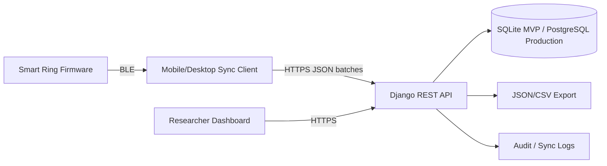
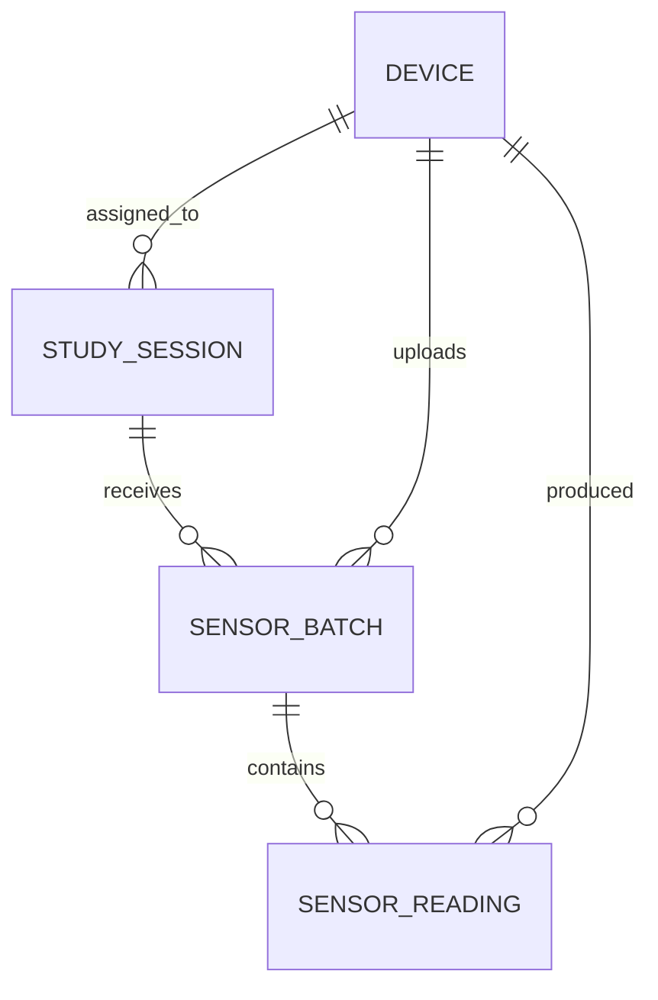

# Architecture Notes

## Scope and assumptions

This document describes an MVP backend architecture for a wearable research platform using smart rings.

The implementation is intentionally smaller than the full platform. It focuses on the backend boundary where wearable data is received, validated, deduplicated, stored, and made available for export.

Key assumptions:

* The smart ring firmware and mobile/desktop sync client are being developed separately.
* The backend does not communicate directly with the ring.
* The ring communicates with a nearby mobile or desktop sync client over BLE.
* The sync client decodes device-level data and submits normalized JSON batches to the backend.
* The backend treats sync payloads as untrusted input.
* Each reading includes an explicit UTC timestamp for the MVP.
* `sequence_number` is optional but useful for detecting gaps and ordering issues.
* `batch_id` is used for duplicate batch detection.
* SQLite is used for the assessment implementation.
* PostgreSQL would be preferred for production.
* Authentication, RBAC, audit logging, and GDPR-grade privacy workflows are documented but not fully implemented.

## MVP architecture

For the MVP, I would use a modular monolith backend with a relational database.

This keeps study, participant, device, session, and ingestion workflows consistent while the product is still changing. A microservice architecture would be premature for the current scope.



Main components:

* **Smart ring firmware**: collects sensor data and stores it locally until sync.
* **Mobile/Desktop sync client**: communicates with the ring over BLE, decodes data, and uploads batches to the backend.
* **Backend API**: validates devices, sessions, sensors, batches, and readings.
* **Database**: stores devices, sessions, batches, and readings.
* **Researcher dashboard**: future frontend for study setup, device/session management, and export.
* **Export workflow**: provides readings for a session as JSON or CSV.
* **Audit/logging layer**: production concern for traceability and research integrity.

## Researcher workflow

A typical MVP workflow:

1. A researcher creates or selects a study.
2. A researcher registers one or more smart-ring devices.
3. A researcher creates anonymized participant/session records.
4. A device is assigned to a participant for a study session.
5. The researcher selects which sensor modules are enabled for that session.
6. The participant wears the ring during the study period.
7. The ring stores sensor readings locally.
8. A mobile or desktop sync client reads data from the ring over BLE.
9. The sync client uploads JSON batches to the backend.
10. The backend validates and stores accepted readings.
11. The researcher retrieves or exports session readings for analysis.

Possible study types:

* sleep and recovery studies
* activity and movement studies
* heart-rate, PPG, SpO₂, and temperature monitoring
* stress or workload studies
* clinical or pre-clinical monitoring pilots
* usability studies involving touch, LED feedback, or haptics
* developer or startup experiments with new modules

The platform is not limited to biometric research. It could support biometric, behavioral, interaction, usability, and device-prototyping studies.

## Data model

The implementation uses a lean model:

* Device
* StudySession
* SensorBatch
* SensorReading



## Device

Represents a physical smart ring.

Core fields:

```text
device_id
firmware_version
hardware_revision
supported_sensor_modules
status
created_at
updated_at
```

Example supported sensor modules:

```text
imu
ppg
temperature
```

The hardware specification also includes RGB LED, vibration motor, touch sensor, onboard storage, Bluetooth, and connectors. For this backend sync exercise, the research data sensors are treated as IMU, PPG, and temperature.

LED and vibration are actuators rather than sensor readings. Touch could later be treated as an event sensor.

## StudySession

A session is a defined data-collection context.

In this MVP, a session means:

> One anonymized participant using one assigned device for one study context, with selected sensors enabled.

Core fields:

```text
session_id
study_name
anonymized_participant_id
assigned_device
enabled_sensor_modules
created_at
updated_at
```

A session connects:

* study context
* anonymized participant
* assigned ring
* enabled sensor modules
* uploaded sensor readings

For the MVP, one session has one assigned device. In production, devices may be reused, swapped, or assigned across time-bound participant sessions.

## SensorBatch

Represents one upload from the sync client.

Core fields:

```text
batch_id
device
session
sensor_type
received_at
```

A uniqueness rule such as `device + batch_id` should prevent duplicate ingestion.

This matters because mobile or desktop sync clients may retry uploads after network failures.

## SensorReading

Represents one timestamped reading.

Core fields:

```text
batch
device
session
sensor_type
timestamp
sequence_number
values
quality_flags
created_at
```

`values` is JSON so that different sensor types can send different payload shapes.

Example temperature value:

```json
{
  "temperature_c": 36.72
}
```

Example IMU value:

```json
{
  "accel_x": 0.01,
  "accel_y": 0.02,
  "accel_z": 0.98,
  "gyro_x": 0.001,
  "gyro_y": 0.002,
  "gyro_z": 0.003
}
```

Example PPG value:

```json
{
  "red": 582134,
  "ir": 604220,
  "ambient": 1821
}
```

In a fuller production system, I would likely add separate models for:

* Organization
* Researcher
* Study
* Participant
* ConsentRecord
* SensorModule
* ExportJob
* AuditLog

For the assessment, `study_name` and `anonymized_participant_id` are kept on the session to keep the implementation focused.

## Backend/API design

Core API responsibilities:

* register devices
* create sessions
* receive sync batches
* validate payloads
* reject unknown or inconsistent device/session/sensor combinations
* prevent duplicate batch ingestion
* store accepted readings
* retrieve/export readings by session

Core endpoints:

```http
POST /api/devices/
GET  /api/devices/{device_id}/

POST /api/sessions/
GET  /api/sessions/{session_id}/

POST /api/sync/batches/
GET  /api/sessions/{session_id}/readings/
GET  /api/sessions/{session_id}/export/
```

The sync batch endpoint validates:

1. Request body is valid JSON.
2. Required fields exist.
3. Device exists.
4. Session exists.
5. Batch device matches session assigned device.
6. Sensor type is supported by the device.
7. Sensor type is enabled for the session.
8. Batch has not already been ingested.
9. Readings contain valid timestamps and JSON values.
10. Batch and readings are stored atomically.

In Django, accepted batches should be saved inside a database transaction so that a malformed or failed batch does not leave partial data behind.

## BLE/mobile sync boundary

The backend does not implement BLE and does not communicate directly with the ring.

The sync client handles:

* BLE connection
* device discovery/pairing
* reading stored data from the ring
* decoding binary or device-specific records
* calibration/unit conversion where appropriate
* retry behavior
* packaging readings into JSON batches
* submitting batches to the backend over HTTPS

The backend handles:

* validating device/session/sensor metadata
* detecting duplicate batches
* storing accepted readings
* exposing readings for export
* logging sync activity in production

At the device level, samples may be compact binary records separated by fixed byte offsets, fixed record lengths, or length-prefixed frames. BLE packets may not align with sensor records, so the sync client must reassemble and decode the device stream.

The backend intentionally receives normalized JSON rather than BLE packets or binary records.

## Sensor data workflow

1. Ring samples IMU, PPG, and/or temperature.
2. Ring stores readings locally in onboard memory.
3. Sync client reads data from the ring over BLE.
4. Sync client decodes the device-level data.
5. Sync client groups readings into batches.
6. Sync client submits JSON batch to backend.
7. Backend validates batch metadata.
8. Backend checks device, session, enabled sensors, and duplicate `batch_id`.
9. Backend validates reading-level data.
10. Backend stores batch and readings atomically.
11. Researcher retrieves or exports readings for a session.

Important data handling principles:

* store sample timestamps in UTC
* store `received_at` separately from reading timestamp
* preserve accepted raw readings as append-only records
* use `batch_id` for idempotency
* use optional `sequence_number` for future gap detection
* keep `quality_flags` for signal or device status information

Possible quality flags:

```text
low_battery
motion_artifact
poor_skin_contact
signal_saturated
missing_sample
estimated_timestamp
```

## Security, privacy, and research integrity

This prototype does not implement real authentication or role-based access control.

Production requirements would include:

* researcher authentication
* organization-scoped access
* study-scoped authorization
* anonymized participant identifiers
* separation of participant identity from sensor readings
* audit logs for ingestion, export, and admin actions
* HTTPS
* consent tracking
* participant withdrawal/deletion workflows
* data retention policies
* export access controls

Security and privacy also affect research integrity.

If participant identity, study group assignment, or raw readings are exposed or modified incorrectly, the platform can compromise both participant protection and study validity.

The backend can support better methodology by:

* storing anonymized participant IDs instead of direct identifiers
* separating identity metadata from sensor readings
* preserving raw readings as append-only records
* logging ingestion and export events
* making duplicate handling explicit
* tracking device, session, batch, and timestamp metadata
* supporting blinded exports where study design requires it

The backend alone cannot guarantee good scientific methodology, but it can provide technical foundations that make sound study design easier to maintain.

## Scaling path

For fewer than 100 devices:

* Django + SQLite/PostgreSQL is sufficient for a prototype.
* Synchronous ingestion is acceptable.
* Direct JSON export is acceptable.
* Simple indexes on session, device, sensor type, and timestamp are enough.

Likely bottlenecks:

* high-frequency IMU data
* large batch payloads
* slow session-level exports
* dashboard queries loading too many raw readings
* unindexed timestamp/session/device queries
* mobile retry storms after offline periods
* duplicate checks under concurrent uploads

At 1,000-10,000 devices:

* move from SQLite to PostgreSQL
* add database indexes and uniqueness constraints
* paginate raw readings
* use background workers for exports
* generate export files asynchronously
* store generated exports in object storage
* downsample or aggregate dashboard data
* partition readings by study/session/date
* monitor ingestion latency, failed syncs, rejected batches, and export duration
* consider time-series storage depending on query patterns

The ring's onboard storage can help buffer unsynced readings during BLE, mobile, or network outages. However, it is only a temporary sync buffer, not a backend scaling solution. At high sampling rates, especially for IMU data, local storage may fill quickly, so firmware and mobile teams need a retention, compression, and confirmation-before-delete strategy.

## Risks and unknowns

Questions for firmware:

* What sampling rates are expected for IMU, PPG, and temperature?
* Are sequence numbers available?
* Are timestamps generated on-device, by the phone, or by the backend?
* How is device clock drift handled?
* How long can the ring store unsynced data?
* What happens when onboard storage is full?
* Are quality or error flags available from the device?
* Are batches created by firmware or by the sync client?

Questions for mobile/desktop sync:

* How does the sync client detect already-uploaded data?
* Does it preserve stable `batch_id`s across retries?
* What retry strategy does it use?
* Can the same batch be uploaded concurrently?
* How are partial BLE transfer failures handled?
* Does the client upload compressed data or plain JSON?
* How does the sync client authenticate to the backend in production?

Questions for product/research:

* What are the first target study types?
* Are sessions short lab recordings or multi-day monitoring periods?
* Do researchers need raw data, processed data, or both?
* What export formats are required?
* What metadata must be included in exports?
* What are the anonymization, consent, and deletion requirements?
* Are devices reused across participants?
* Is blinding or study-group separation required?

## Future sync protocol enhancement

A production sync protocol may use explicit instructions from the backend to the sync client.

For example:

```json
{
  "cursor": {
    "after_sequence": 500
  },
  "filters": {
    "sensor_types": ["temperature", "ppg", "imu"]
  },
  "limits": {
    "max_readings": 500,
    "max_payload_kb": 256
  }
}
```

This would support initial sync, incremental sync, and recovery sync.

For this assessment, I treated that as a future enhancement rather than the core implementation. The required MVP is focused on registering devices, creating sessions, ingesting batches, validating input, handling duplicates, and retrieving/exporting readings.
